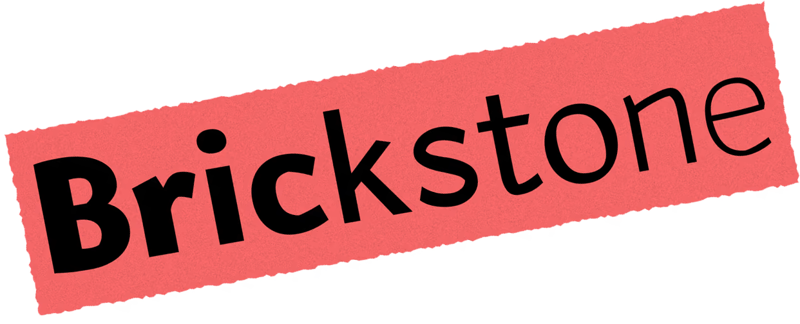
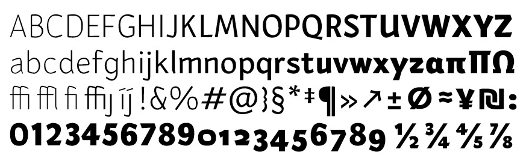
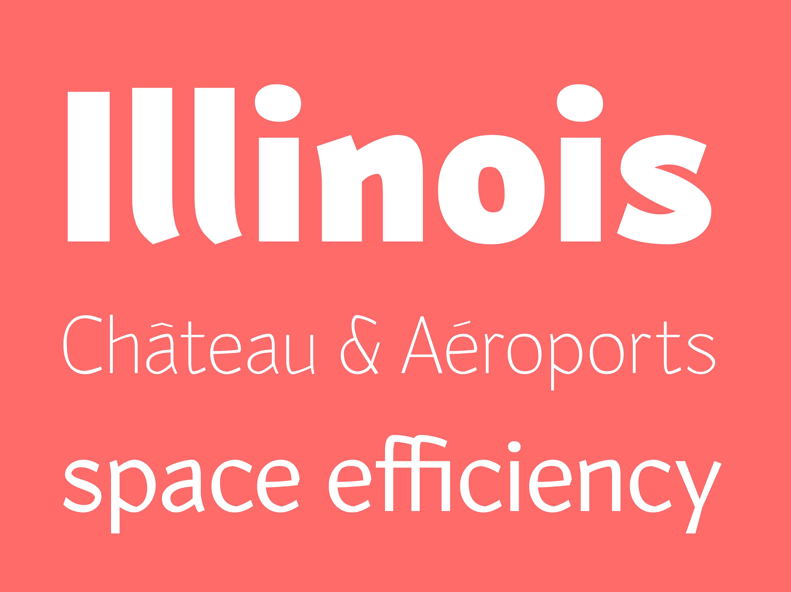
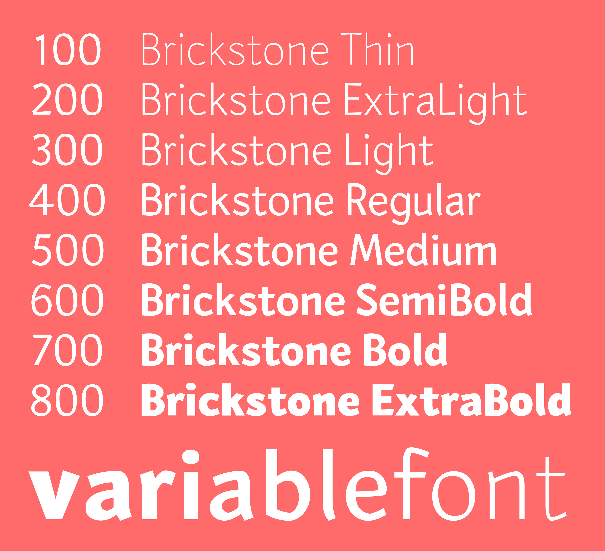
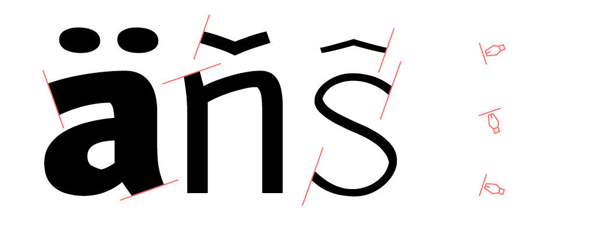
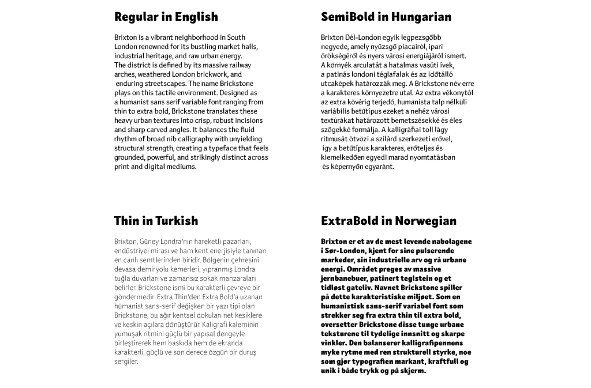
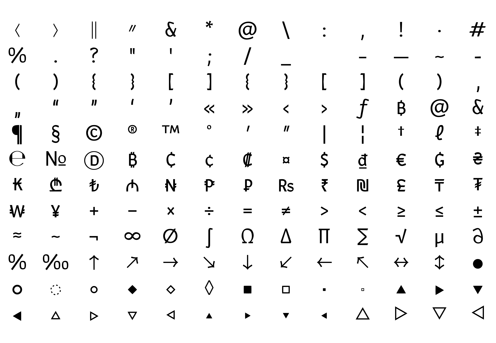

**Brickstone** is a humanist sans-serif variable typeface, ranging from Thin to ExtraBold. It's a practical, distinctive typeface, equally comfortable in print and on screen, in display sizes and running text. 

An expressive font that's comfortable read:  Brickstone was designed for everyone, with accessibility at its center, and human touch all around. Its distinctive characters are well suited for magazines, websites, unique visual identities, and marketing purposes equally well.

## Basic character set

Clarity at its core.

## Variable Font

Brickstone is a **Variable Font** featuring a continuous **Weight (`wght`)** axis ranging from `100` to `800`.

## Formal features

Sharp incisions and sudden breaks mirror a broad-nib pen on paper. An ongoing experiment in form.

  

**Origins**  
Brickstone is a modern sans serif inspired by broad-nib calligraphic mechanics. Starting as an experiment with reversed-angle strokes on a Pilot Parallel Pen, its raw calligraphic cuts were translated into a balanced, contemporary type system featuring a modern x-height and sharp, characterful details.

  

---

## Language Support

Brickstone provides broad linguistic coverage, supporting European Latin-based languages across Western, Central, Eastern, Northern, and Southern Europe.

---

## Punctuation and Symbols

Includes a comprehensive set of punctuation, currency marks, mathematical operators, geometric shapes, and symbols.

---

## Building from source

> **Note:** To build from source, you will need **Python 3.9.5 or higher** and [Glyphs](https://glyphsapp.com/) to open the source files in the `sources/` folder.

To build the static `.ttf`, `.otf`, `.woff2`, and variable `.ttf` files:

1. Install the required tools:

`pip install gftools fonttools[woff] fontbakery`

2. Run the build process:

`gftools builder sources/config.yaml`

  After the process completes, all generated font files will be in the fonts/ folder.

## License

Brickstone is licensed under the [SIL Open Font License, Version 1.1](OFL.txt), available with a FAQ at https://openfontlicense.org.

## Credits

**Type design:** Miklós Ferencz  
**Foundry:** Accentype
