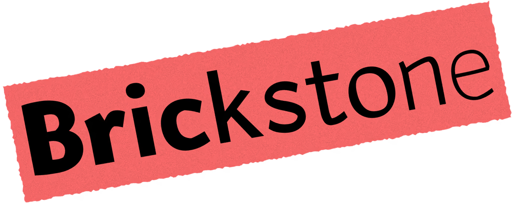
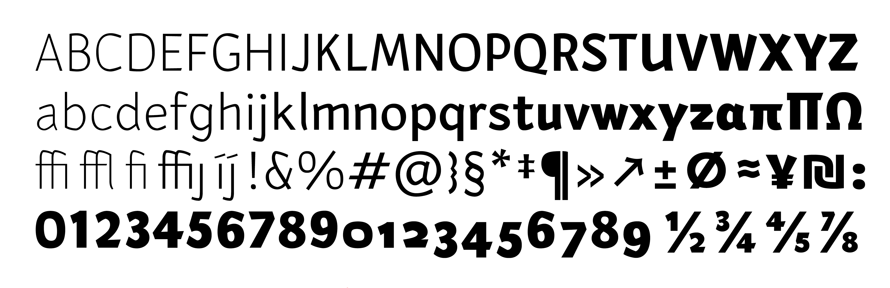
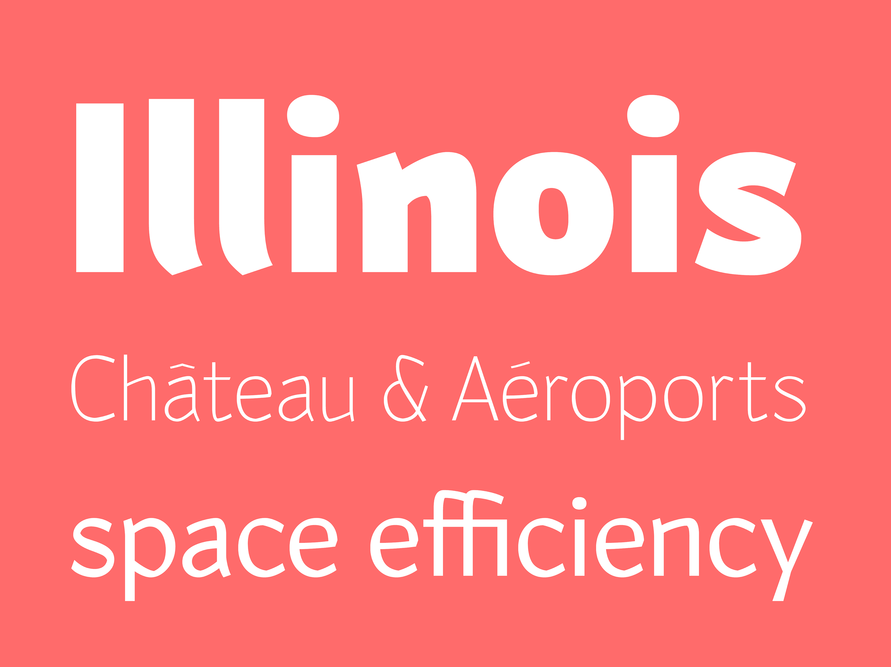
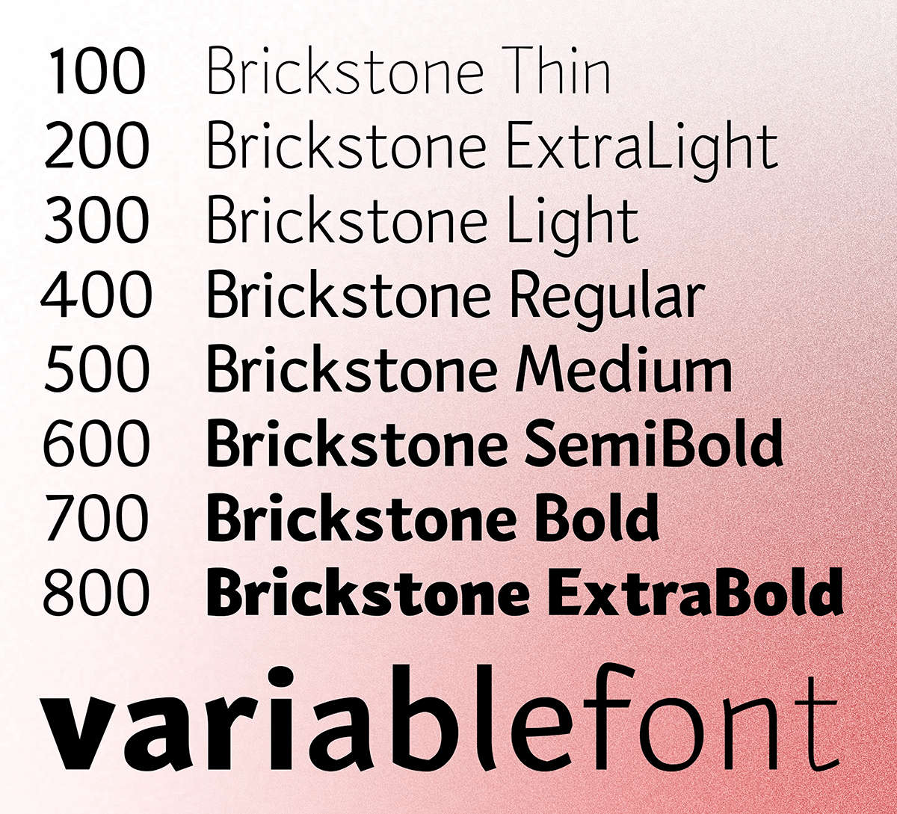
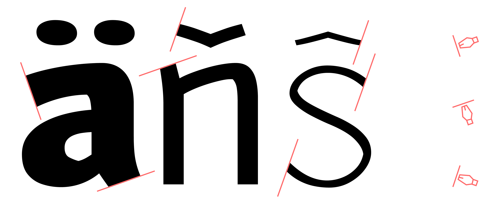
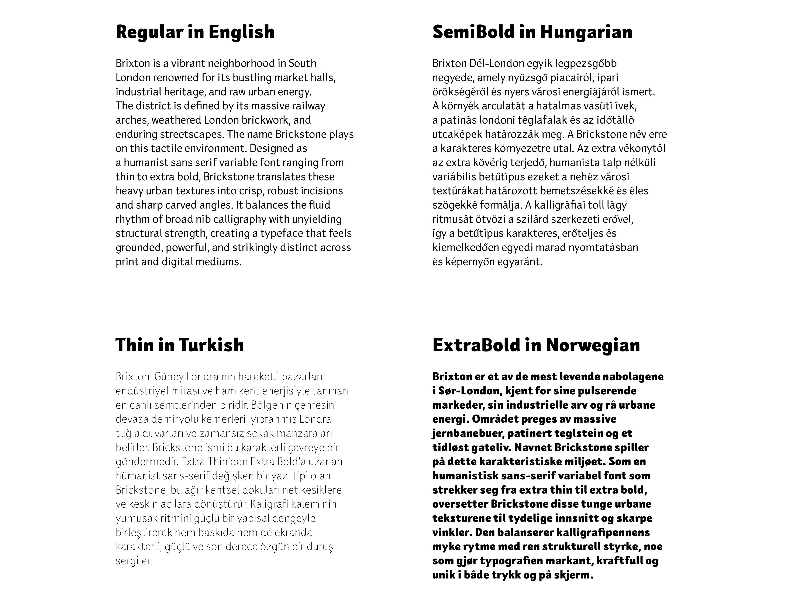
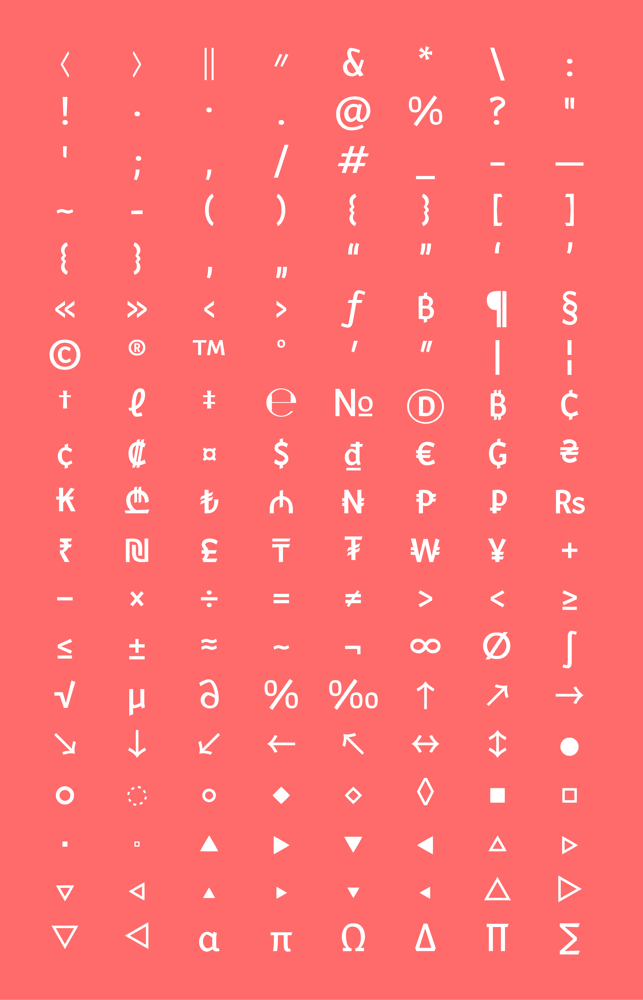

Brickstone is a variable, humanist, sans-serif font, with weights ranging from Thin to ExtraBold. Drawing inspiration from calligraphy and stone carving, the font seamlessly blends fluid lines with sharp angles. It is crisp and expressive in display settings while remaining highly legible in continuous text. Used in print or on screen, Brickstone performs well in all application environments, making it a practical and versatile choice.

## Latin character set

Clarity at its core.

## Variable Font

Brickstone is a variable font featuring a continuous weight (`wght`) axis ranging from `100` to `800`.

## Formal features

Sharp incisions and sudden breaks mirror a broad-nib pen on paper. An ongoing experiment in form.

  

**Origins**  
Brickstone is a modern sans serif inspired by broad-nib calligraphic mechanics. Originating as an experiment with varying stroke angles using a Pilot Parallel Pen, the typeface translates raw calligraphic cuts into a functional system.

  

---

## Language Support

Brickstone provides broad linguistic coverage, supporting European Latin-based languages across Western, Central, Eastern, Northern, and Southern Europe.

---

## Punctuation and Symbols

Includes a comprehensive set of punctuation, currency marks, mathematical operators, geometric shapes, and symbols.

---

## Building from source

> **Note:** To build from source, you will need **Python 3.9.5 or higher** and [Glyphs](https://glyphsapp.com/) to open the source files in the `sources/` folder.

To build the static `.ttf`, `.otf`, `.woff2`, and variable `.ttf` files:

1. Install the required tools:

`pip install gftools`

2. Run the build process:

`gftools builder sources/config.yaml`

  After the process completes, all generated font files will be in the fonts/ folder.

## License

Brickstone is licensed under the [SIL Open Font License, Version 1.1](OFL.txt), available with a FAQ at https://openfontlicense.org.

## Credits

**Type design:** Miklós Ferencz  
**Foundry:** Accentype
